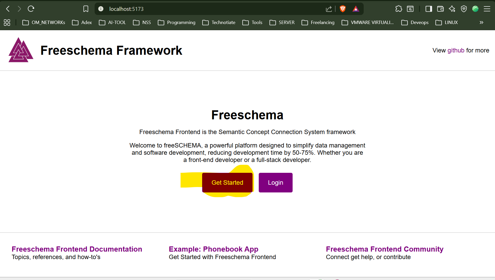
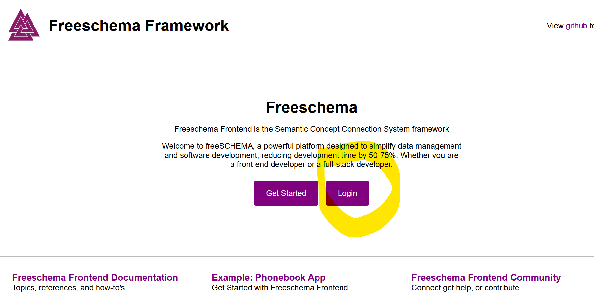
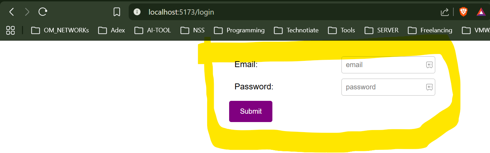

# To-Do List Application (FreeSchema)

## 📌 Project Overview

This project is a **To-Do List Application** developed as part of the **System Administrator and DevOps Engineer Task** using **FreeSchema Data Fabric**.

The application demonstrates a complete **CRUD (Create, Read, Update, Delete)** workflow using **FreeSchema’s schema-driven architecture**, without using traditional REST APIs.

> ⚠️ Note:  
> The **Phonebook module** present in this repository is a **reference example provided by FreeSchema**.  
> The **To-Do application is my own implementation**, created by extending the same project and framework.

---

## 🎯 Task 1 – Requirements Covered

The To-Do application fully satisfies all Task 1 requirements:

- ✅ Create a new task  
- ✅ List all tasks  
- ✅ Edit an existing task  
- ✅ Delete a task  

Each task contains:
- **Title**
- **Description**
- **Status** (pending / completed)

---

## 🛠️ Technologies Used

- **FreeSchema Data Fabric**
- **TypeScript**
- **Vite**
- **HTML & CSS**

---

## 📂 Relevant Project Structure

```
src/
 ├── pages/
 │   ├── example/        # Reference Phonebook 
 │   └── todo/           # ✅ To-Do application   (implemented by me)
 │       ├── create.todo.ts
 │       ├── list.todo.ts
 │       ├── wrapper.todo.ts
 │       └── todo.style.css
 │
 ├── routes/
 │   └── routes.ts       # To-Do route added here
```

---

## 🚀 How to Run the Project

### 1️⃣ Prerequisites

Ensure you have:
- Node.js (v18 or above)
- npm

Check versions:
```bash
node -v
npm -v
```

---

### 2️⃣ Clone  the guthub Repository  and navigate to the project root directory 

```
git clone https://github.com/Nitesh0ne/mentor-friends-todo-app.git

cd mentor-friends-todo-app

```


### 3️⃣ Install Dependencies

```bash
npm install
```

---

### 4️⃣ Start the Development Server

```bash
npm run dev
```

---

## 🔐 Authentication Required

Before accessing the application, users **must create an account and log in**.

### Steps to Access the Application

1️⃣ **Register a New Account**
- Open the application in your browser
- Navigate to the **Get Started** page.

- Create a new account using valid details.


2️⃣ **Login**
- Use Previous Register Credentiasl to Login,After successful registration, log in using your credentials





3️⃣ **Access the To-Do Application**
- Once logged in, open:
**http://localhost:5173/todo**


## 🧠 How the To-Do App Works

- Built using **FreeSchema concepts and compositions**
- No REST APIs or backend controllers
- CRUD operations handled via:
  - `MakeTheInstanceConceptLocal`
  - `CreateTheConnectionLocal`
  - `UpdateComposition`
  - `DeleteConceptById`
- Data synchronization handled by:
  - `LocalSyncData.SyncDataOnline()`

---

## 🧪 Features Demonstrated

- Schema-driven data modeling
- Real-time task listing using listeners
- Edit mode handling using shared widget state
- Manual form reset for better user experience


## 📞 References & Support

- FreeSchema Documentation  
  https://documentation.freeschema.com

- FreeSchema Frontend Reference  
  https://github.com/Mentor-Friends/Freeschema-Frontend

---

